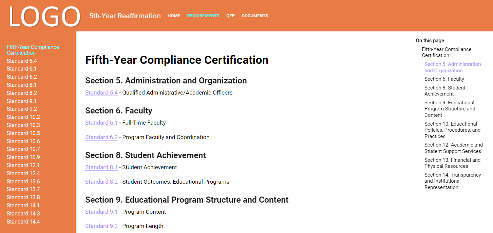
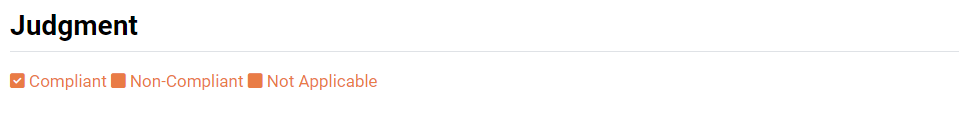
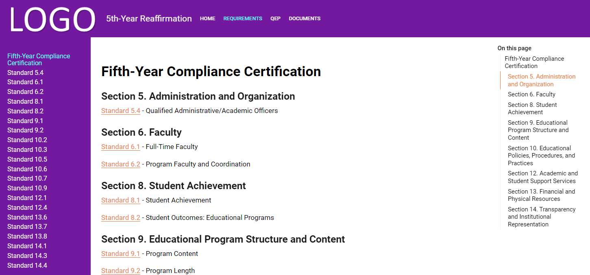
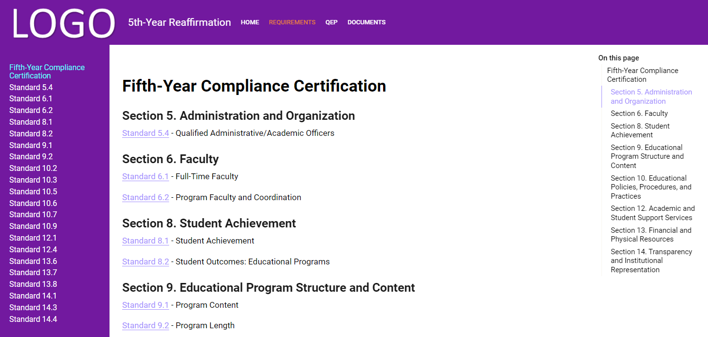
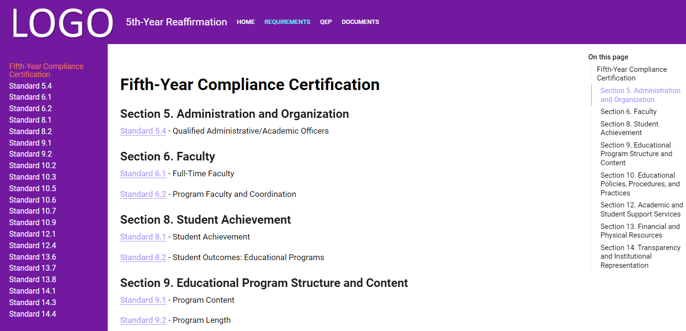

The `compliance-report` repository is the scaffolding needed to create a Quarto project for compiling compliance reports for accreditatoin. The initial setup is for a Fifth-Year Interim Report for accreditation with Southern Association of Colleges and Schools Commission on Colleges (SACSCOC).

## Prerequisites


### Quarto

You must install the latest version of Quarto, which can be found at this link:

```
https://quarto.org/
```

The `compliance-report` repository is designed to work with Quarto 1.5+.

The FontAwesome5 extension is also needed, but cannot be installed until after the repository is cloned and configured.

### Clone repository


## Configure Quarto

### Install FontAwesome

```
quarto add quarto-ext/fontawesome
```

### YAML Changes

#### Change Logo

_quarto-website.yml

```
  navbar:
    logo: images/GenericLogo.png
```


_quarto-pdf.yml

```
book:
  title: "5th-Year Reaffirmation"
  author: "Author"
  sidebar:
    style: docked
    logo: images/GenericLogo.png
```

#### Change Favicon (website icon)

_quarto-website.yml

```
website:
  title: "5th-Year Reaffirmation"
  favicon: images/Mountain.png
```


#### Change Theme

\_quarto-website.yml

```
format:
  html:
    theme: HCC_custom.scss
```

### CSS and SCSS Changes

Change the colors to colors that align with your school's brand using the guide below.

#### Changes to `custom.scss`

**Resources**

- [Quarto: HTML Theming](https://quarto.org/docs/output-formats/html-themes.html)
- [HTML Theming: Dark Mode](https://quarto.org/docs/output-formats/html-themes.html#dark-mode)
- [More About Quarto Themes](https://quarto.org/docs/output-formats/html-themes-more.html)
- [Github: Bootstrap Themes](https://github.com/quarto-dev/quarto-cli/tree/main/src/resources/formats/html/bootstrap/themes)

**Comments**
- Entire line: `// Enter comment here`
- In-line: `/* Enter comment here */`

##### Change custom colors

```
//Enter your custom colors here using hex color codes
$custom1: #7030A0 !default; // Dark Purple
$custom2: #9999FF !default; // Light Purple
$custom3: #00FFFF !default; // Aqua
```


###### Custom1

```
$dark:          $custom1 !default;
```


```
 span[data-custom-style="Judgment"] {
   color: $custom1;
 }
```




###### Custom2

```
// Change the link text color here

$link-color:                $custom2 !default;

```


```

$sidebar-hover-color:               $custom2 !default; /* changes the font color of the item that is hovered over */

```


###### Custom3

```
$navbar-hl:                         $custom3 !default; /* changes the font color of the selected item */
```



```
$sidebar-active-color:               $custom3 !default; /* changes the font color of the selected item */
```



##### Adjust Logo Positioning

```
// Change the navbar Logo's position

.navbar-brand {
  max-height: unset;
  margin: -1px; /* changes the margin around the logo: smaller# = smaller margin & larger# = larger margin */
  margin-right: 10px; /* moves the section titles to the right of the title: smaller# = moves left & larger# = moves right */
}

.navbar-logo {
  max-height: unset;
  max-width: unset;
  height: unset;
  width: 250px; /* changes the width of the logo: smaller# = smaller width & larger# = larger width */
  margin-top: -10px; /* changes the margin at the top of the logo: smaller# = logo moves up & larger# = logo moves down */
  margin-left: -19px; /* changes the margin to the left of the logo: smaller# = logo moves left & larger# = logo moves right */
  margin-bottom: -20px; /* changes the margin to the right of logo: smaller# = logo moves down & larger# = logo moves up */
}
```


#### Changes to `custom.css`

The changes go here with screenshots to help user understand exactly which portion is being changed.

### Changes to `ConvertFrom-Docx-To-Md.ps1`

The PowerShell script is very opinionated and may need tailored to your needs. The following are expectations made by the script.

#### Expectations

The following files are expected to be included:

##### Standard files

- Standard 05.4
- Standard 06.1 (CR)
- Standard 06.2
- Standard 08.1 (CR)
- Standard 08.2
- Standard 09.1 (CR)
- Standard 09.2 (CR)
- Standard 10.2
- Standard 10.3
- Standard 10.5
- Standard 10.6
- Standard 10.7
- Standard 10.9
- Standard 12.1 (CR)
- Standard 12.4
- Standard 13.6
- Standard 13.7
- Standard 13.8
- Standard 14.1
- Standard 14.3
- Standard 14.4

##### QEP

- QEP Impact Report

##### Other files

- Welcome - PDF
- Welcome - Website
- Overview
- Leadership
- Requirements
- Signatures 
- Summary
- Support
- Documents

#### Folder structure

The files can be arranged either all in one folder or in folders. 

##### Same Folder

The folder structure should look like the following:

- `Source Folder`
    - _Artifacts (folder with all the artifacts)
    - Documents.docx
    - Leadership.docx
    - Overview.docx
    - QEP Impact Report.docx
    - Requirements.docx
    - Signatures.docx
    - Standard 05.4.docx
    - ...(and additional files for each standard)
    - Summary.docx
    - Welcome - PDF.docx
    - Welcome - Website.docx

##### Multiple Folders

The original script was written to accomodate folders that were synchronized with Microsoft Teams where each standard and QEP Impact Report was placed in a separate channel with the same name as the file, while the other files were all included in one channel named "Other Supporting Documents".

- `Teams Organization Path`
    - `Team Name`
        - Other Supporting Documents
            - Documents.docx
            - Leadership.docx
            - Overview.docx
            - Requirements.docx
            - Signatures.docx
            - Summary.docx
            - Welcome - PDF.docx
            - Welcome - Website.docx
        - QEP Impact Report
            - QEP Impact Report.docx
        - Standard 05.4
            - _Artifacts
            - Standard 05.4.docx
        ... (and additional folders for each standard)

